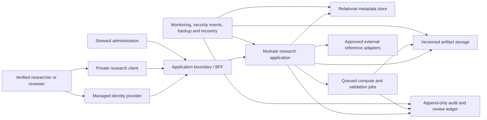

# Private Application Transition Execution Map

Status: planning baseline

Owner and steward: AI-Bio Synergy Holdings LLC

Public baseline: `v0.1.4-research-alpha`

This document defines the control-level boundary for moving COSMOS-CQA from a static public research demo into a separate selective-access application for verified researchers and institutions. It is an execution map, not application code, an access offer, a security certification, a legal opinion, a data-use agreement, or approval to process partner data.

Deployment-specific topology, credentials, provider account details, private repository locations, incident details, and exploit-relevant configuration belong only in the private application environment.

## Outcome

The transition should produce a controlled research application that can:

- verify researcher and institutional identities;
- isolate organizations, projects, datasets, and review assignments;
- preserve deterministic COSMOS-CQA contracts, provenance hashes, review events, and evidence exports;
- route observations through authenticated review and adjudication workflows;
- enforce partner-specific data rights, retention, and export rules;
- support security monitoring, incident response, recovery, and access review;
- remain claim-bounded research infrastructure rather than a validated diagnostic or production scientific decision system.

## Decisions To Lock Before Implementation

1. Create a separate private repository as the application system of record.
2. Keep this public repository static, local-first, account-free, and free of private authentication, backend, partner data, and operational secrets.
3. Import public contracts and deterministic fixtures from an exact public release tag or content hash. Do not copy mutable files without provenance.
4. Start the private application as a modular monolith. Split services only when security isolation, independent scaling, failure containment, or team ownership creates a measured need.
5. Use a managed identity provider through standard federation. Do not build password storage, identity proofing, or institutional federation from scratch.
6. Enforce authorization server-side at organization, workspace, project, dataset, assignment, observation, and export boundaries.
7. Use synthetic fixtures until data rights, security, retention, ethics, and partner approvals are documented.
8. Treat every external computation or AI integration as a server-side, authenticated, audited adapter with separate terms and scientific caveats.
9. Keep scientific claims, partner commitments, support levels, and access timelines outside public copy until separately approved.

## Repository And IP Boundary

| Surface | Public COSMOS-CQA repository | Private selective-access application |
| --- | --- | --- |
| Purpose | Citable research-source demo, schemas, deterministic fixtures, public documentation | Authenticated research workspaces, partner data, queues, operations, and private integrations |
| Access | Public read access under the research-only license | Invite-only access under separate written terms |
| Data | Synthetic fixtures, permitted public references, local browser artifacts | Approved partner datasets and controlled research artifacts only after readiness gates pass |
| Identity | No accounts or verified reviewer identity | Federated identity, affiliation verification, access review, suspension, and revocation |
| Review transport | Local JSON packet export/import | Authenticated assignment, submission, review, return, and adjudication state |
| Secrets | None | Managed outside source control with environment-scoped access |
| Releases | Public tags, SBOMs, validation reports, Zenodo DOI | Private release records, deployment evidence, migration records, and partner-specific change control |
| Rights | Research-only public license; all other rights reserved | Separate private access, confidentiality, data-use, support, and commercial terms as applicable |

Private changes may flow back to the public repository only after the steward approves scope, IP, licensing, security, data-rights, scientific-claim, and documentation review. No partner data, private configuration, institution-specific policy, or confidential implementation detail should flow back by default.

## Recommended Logical Architecture

The first private build should preserve the existing package boundaries and add the minimum service layer needed for identity, persistence, audit, and controlled compute.

### Private Research Client

- Reuse public domain contracts and deterministic helpers where they remain fit for purpose.
- Treat client state as a view and editing surface, not the authorization authority.
- Preserve accessibility, keyboard, responsive, audio-safety, and claim-boundary behavior from the public workbench.
- Make organization, workspace, project, dataset, assignment, and review context visible before consequential actions.

### Application Boundary

- Use a backend-for-frontend or equivalent application boundary to terminate authenticated browser sessions.
- Validate every input against versioned schemas before persistence or queued processing.
- Apply tenant, resource, role, assignment, and state-transition authorization on every request.
- Issue short-lived, narrowly scoped access to stored artifacts instead of exposing storage credentials.
- Apply rate limits, request size limits, replay protection where required, and safe error handling.

### Modular Research Application

- Begin with one deployable application divided into explicit identity, organization, project, intake, observation, review, adjudication, evidence, reporting, and administration modules.
- Keep deterministic domain logic in reusable packages and isolate network, persistence, and provider adapters.
- Use transactional state transitions for assignments, submissions, reviews, adjudication, and exports.
- Add an outbox or equivalent durable event pattern before asynchronous side effects become operationally important.

### Data Stores

- Use a relational store for identities, memberships, projects, assignments, workflow state, policy records, and artifact metadata.
- Use versioned object storage for permitted tiles, manifests, evidence bundles, reports, SBOMs, and import/export artifacts.
- Keep append-only security and research-audit records separate from mutable presentation state.
- Encrypt data in transit and at rest; manage keys, credentials, and service identities outside source control.
- Define backup, restore, integrity verification, and deletion behavior before real partner data is accepted.

### Compute And External References

- Route expensive diagnostics, report generation, file validation, and external computational references through bounded jobs.
- Pin code, schema, input hashes, parameters, and environment metadata needed for replay.
- Treat job output as an artifact requiring provenance and review, not as scientific validation.
- Keep Wolfram or other external computational access server-side, authenticated, authorized, rate-limited, terms-reviewed, and audited.

## Authentication And Authorization Model

Identity controls should be selected through a documented digital identity risk assessment informed by [NIST SP 800-63-4](https://doi.org/10.6028/NIST.SP.800-63-4). NIST separates identity proofing, authentication, and federation assurance; COSMOS-CQA should record its chosen targets instead of claiming compliance by reference.

### Account Entry

- No open self-registration for the first research pilot.
- A named institutional sponsor or steward initiates an invitation.
- Verify email domain, affiliation, role, and project need through a documented process.
- Use federated OIDC or SAML when the institution supports it; use a managed fallback identity flow only after risk review.
- Require phishing-resistant authentication for stewards, institutional administrators, data stewards, adjudicators, and other privileged roles, consistent with the approved assurance and MFA policy. Evaluate passkey configurations against that policy rather than treating every passkey implementation as equivalent.
- Separate human identities from service identities and prohibit shared accounts.

### Role Baseline

| Role | Minimum responsibility | Explicit exclusions |
| --- | --- | --- |
| Steward administrator | Platform policy, emergency access, release and risk decisions | Does not silently alter research evidence |
| Institutional administrator | Institution membership and approved workspace administration | No cross-institution access |
| Project owner or principal investigator | Project protocol, membership requests, dataset and export approvals | No platform-wide administration |
| Researcher | Permitted project analysis, observations, and evidence preparation | No reviewer qualification or adjudication by default |
| Reviewer | Assigned review tasks and review events | No self-assignment or policy administration |
| Adjudicator | Assigned disagreement resolution with recorded rationale | No deletion of prior review evidence |
| Data steward | Dataset rights, classification, retention, export, and deletion decisions | No scientific adjudication by role alone |
| Auditor or read-only reviewer | Scoped evidence, access, and control review | No mutation privileges |
| Service identity | One bounded machine function | No interactive login or broad tenant access |

### Authorization Rules

- Deny by default.
- Evaluate organization membership, project membership, resource ownership, assignment, role, record state, and data classification server-side.
- Use object-level authorization for every tile, artifact, observation, review event, report, and export.
- Require step-up authentication for privileged changes, bulk exports, access-policy changes, key rotation, and break-glass actions.
- Record grant, denial, elevation, suspension, revocation, and access-review decisions.
- Do not rely on hidden controls, client routes, or role names supplied by the browser.
- Review the application against [OWASP ASVS 5.0.0](https://owasp.org/www-project-application-security-verification-standard/) using versioned requirement identifiers in private verification evidence.

### Account Lifecycle

`invited -> identity verified -> terms accepted -> scoped access approved -> active -> periodic review -> suspended or revoked -> archived`

Account recovery, institutional departure, sponsor withdrawal, role change, inactive accounts, compromised authenticators, and emergency revocation must have documented owners and evidence.

## Data Governance Model

### Classification

| Class | Examples | Initial handling |
| --- | --- | --- |
| Public | Public documentation, released schemas, synthetic fixtures, permitted public references | May remain in the public repository when rights and provenance are clear |
| Internal | Architecture decisions, test plans, non-sensitive operations, private backlog | Private repository and approved collaboration tools |
| Confidential research | Unpublished observations, partner datasets, reviewer identity, institutional project records | Approved private workspace, least privilege, encryption, audit, retention schedule |
| Restricted or regulated | Controlled datasets, export-controlled material, sensitive personal data, personal health information, regulated records | Excluded by default until counsel, security, data steward, institution, and protocol approvals explicitly authorize handling |

### Required Dataset Record

Before intake, record:

- owner or source authority;
- license, data-use agreement, access conditions, and redistribution limits;
- permitted purpose and approved project;
- sensitivity and regulatory classification;
- geographic residency or transfer constraints when applicable;
- checksum, release, DOI or source URL, transformation history, and parent artifacts;
- retention, deletion, backup, export, publication, and partner-exit rules;
- named data steward and incident contact;
- ethics or institutional review determination when human participation or identifiable data may be involved.

### Lifecycle

1. Propose: classify the source and purpose without uploading restricted content.
2. Approve: complete rights, security, ethics, retention, and workspace decisions.
3. Ingest: validate type, size, malware controls, schema, checksum, and provenance in an isolated path.
4. Use: enforce project scope, purpose, access, transformations, and derivative-artifact linkage.
5. Review: record observation, review, adjudication, and export events without rewriting prior evidence.
6. Export or publish: require policy checks, redaction where needed, license review, provenance, and approval.
7. Retain or delete: execute the approved schedule, legal hold if applicable, backup expiry, and verifiable deletion record.
8. Exit: revoke access, return or destroy partner data, preserve permitted audit evidence, and document disposition.

### Data Rules

- Minimize personal and institutional profile data.
- Keep identity evidence separate from research observations wherever practical.
- Use synthetic or de-identified examples for development and support.
- Do not infer consent, redistribution rights, or public-release rights from technical access.
- Prevent cross-tenant search, cache, logs, exports, job outputs, and object references.
- Record provenance hashes, schema versions, application version, actor, organization, project, source artifact, and policy context for consequential evidence.
- Define retention by artifact class; do not use one indefinite default.
- Test backup restoration and tenant-scoped deletion before partner data is accepted.

## Research Partner Onboarding

The first contact remains non-confidential. No dataset upload, account promise, or research commitment should occur until the relevant gate is approved.

### Partner Qualification Packet

- organization and primary sponsor;
- scientific or educational purpose;
- proposed datasets and their rights/status;
- expected users, roles, reviewer qualifications, and adjudication model;
- data sensitivity, residency, retention, and export expectations;
- security, accessibility, and institutional policy requirements;
- anticipated computational integrations;
- ethics or institutional review contact and determination, if applicable;
- publication, citation, IP, support, and partner-exit expectations.

### Required Agreements And Decisions

Depending on scope, the steward and partner may need confidentiality terms, a research collaboration agreement, data-use terms, an IP/publication plan, security responsibilities, a support boundary, and a data processing agreement. These are scope-dependent legal and institutional decisions, not conclusions supplied by this document.

For activities involving human contributors or identifiable information, the responsible institution should determine whether ethics or human-subject review applies. The [HHS OHRP decision charts](https://www.hhs.gov/ohrp/regulations-and-policy/decision-charts/index.html) are one U.S. reference and do not replace institutional or jurisdiction-specific review.

### Onboarding Sequence

`non-confidential inquiry -> fit review -> confidentiality decision -> protocol and data review -> security and identity review -> agreement approval -> named workspace owners -> synthetic sandbox -> acceptance review -> limited pilot -> periodic review -> offboarding`

## Security And Operations Baseline

Use [NIST Cybersecurity Framework 2.0](https://www.nist.gov/cyberframework) as an outcome vocabulary across Govern, Identify, Protect, Detect, Respond, and Recover. Do not claim CSF conformance without a defined profile and evidence.

Before a partner pilot, document and test:

- threat model and trust boundaries;
- secure development and ASVS verification target;
- dependency, SBOM, provenance, secret, and vulnerability management;
- environment separation and least-privilege deployment identities;
- security logging, alerting, clock synchronization, and audit retention;
- incident triage, partner notification responsibilities, containment, recovery, and post-incident review;
- backup, restore, integrity check, continuity objective, and data-loss objective;
- access review, break-glass control, and privileged-action review;
- data import, export, deletion, and partner-exit exercises;
- accessibility, usability, audio-safety, and scientific-claim regression checks.

## Delivery Strategy

The private application should advance through explicit gates rather than a feature-first roadmap:

1. Transition authorization and private repository controls.
2. Architecture decision records and threat model.
3. Identity, organization, workspace, and authorization foundation using synthetic data.
4. Data classification, provenance, storage, audit, backup, and deletion foundation.
5. Public-contract parity for Core Pack intake, observations, review events, reports, sessions, and evidence bundles.
6. Authenticated reviewer assignment and adjudication with immutable history.
7. Synthetic partner sandbox and operational exercises.
8. Limited partner pilot after written approvals.

The detailed gates, exit evidence, and private backlog seed are in `docs/private-application-readiness-gates.md`.

## Decision Register

| Decision | Current position | Required owner/evidence |
| --- | --- | --- |
| Repository boundary | Separate private repository | Steward approval and repository controls |
| Initial application shape | Modular monolith | Architecture decision record and threat model |
| Identity provider | Managed federation; vendor undecided | Identity risk assessment, partner requirements, recovery review |
| Tenant model | Organization and project scoped; isolation mechanism undecided | Data isolation ADR and tests |
| Hosting region/provider | Undecided | Data residency, security, cost, recovery, and partner review |
| Public contract synchronization | Pin exact public tag/hash | Provenance manifest and compatibility gate |
| Audit design | Append-only evidence required | Event model, retention, access, export, and integrity test |
| External computation | Server-side adapters only | Terms, security, scientific caveat, rate limit, and audit review |
| Real partner data | Prohibited until readiness gates pass | Written data, security, ethics, and partner approvals |

## Success Measures

- 100 percent of active users have verified sponsor, organization, role, and last access-review date.
- 100 percent of privileged roles use the approved MFA/authenticator policy.
- 100 percent of persisted research artifacts have tenant, project, schema, source, checksum, and retention context.
- 100 percent of review and adjudication mutations emit immutable audit events.
- Cross-tenant authorization tests and export tests pass before every partner-facing release.
- Evidence bundles replay against pinned contracts without silent semantic drift.
- Backup restore, access revocation, incident exercise, and partner offboarding are tested before the first real-data pilot.
- Accessibility, audio safety, license, claim-boundary, SBOM, and vulnerability gates remain release requirements.

## Non-Goals

- Public self-service signup.
- Open submission of observations to a hosted queue.
- Clinical, regulatory, safety-critical, or autonomous scientific decisions.
- Scientific validation by software contract or workflow completion.
- Live redistribution of third-party datasets without explicit rights.
- Public disclosure of private infrastructure, credentials, security findings, partner agreements, or institution-specific controls.
- Immediate microservices, multi-region operation, or broad external API access without measured need.

## References

- [NIST SP 800-63-4, Digital Identity Guidelines](https://doi.org/10.6028/NIST.SP.800-63-4), final publication dated August 1, 2025.
- [NIST Cybersecurity Framework 2.0](https://www.nist.gov/cyberframework), cybersecurity risk-management outcomes and profiles.
- [OWASP Application Security Verification Standard 5.0.0](https://owasp.org/www-project-application-security-verification-standard/), web application security verification requirements.
- [HHS Office for Human Research Protections decision charts](https://www.hhs.gov/ohrp/regulations-and-policy/decision-charts/index.html), U.S. human-subject research decision support.

References provide planning inputs. Applicability, assurance targets, legal duties, ethics review, and partner obligations require separate decisions by qualified owners.
